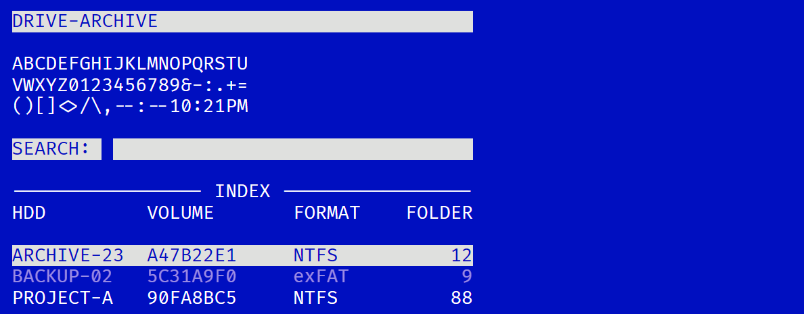
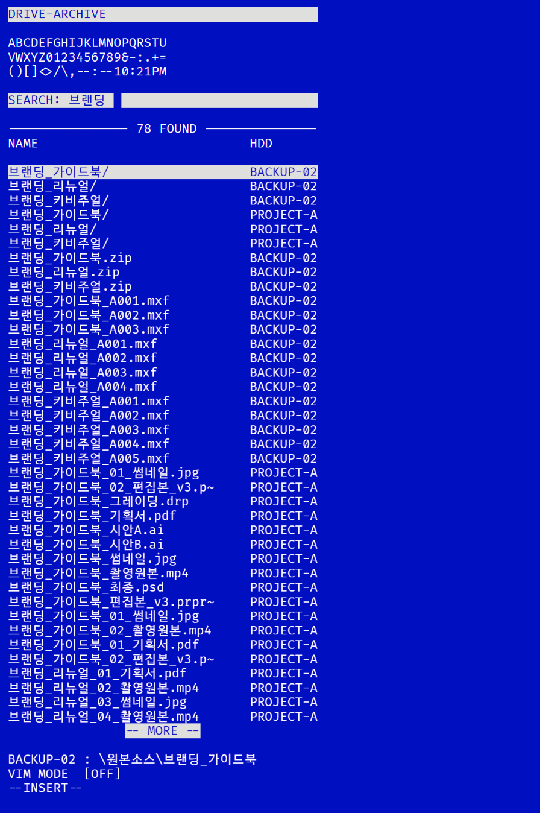
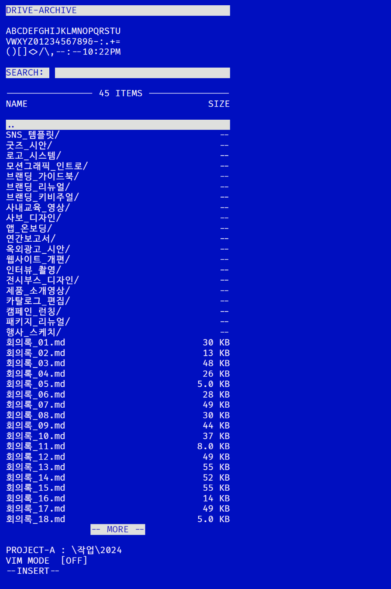

# drive-archive

**한국어** · [English](README_en.md)

> 외장하드에 흩어진 자료를 인덱싱하고, **하드를 연결하지 않아도** 어느 하드에 무엇이 있는지 검색할 수 있게 해주는 도구

여러 개의 외장하드에 프로젝트 자료를 나눠 보관하다 보면 "그 파일이 어느 하드에 있었지?"라는 문제가 생깁니다. 하드를 하나씩 꽂아 보는 것 말고는 방법이 없습니다.

drive-archive는 외장하드가 **연결될 때마다 자동으로** 그 안의 파일·폴더 목록을 로컬 데이터베이스에 기록합니다. 그 다음부터는 하드가 책상 서랍에 있어도, 컴퓨터에서 검색만 하면 어느 하드에 있는지 바로 알 수 있습니다.

```
$ drive-archive search "2024 브랜딩"

  [PROJECT-A]  작업/2024/브랜딩_리뉴얼/          (folder, 2024-11-03)
  [PROJECT-A]  작업/2024/브랜딩_리뉴얼/최종.psd   (1.2 GB, 2024-11-03)
  [BACKUP-02]  보관/2024브랜딩_백업.zip          (3.4 GB, 2024-12-20)

  → Connect these drives: PROJECT-A.
```

---

## 브라우저로 보기

`drive-archive serve`를 실행하면 브라우저에서 인덱스를 직접 들여다볼 수 있습니다. Claude를 거치지 않아도 되고, 하드를 꽂지 않아도 됩니다.



어느 하드에 폴더가 몇 개 들어 있는지, 지금 꽂혀 있는지가 한눈에 보입니다. 연결되지 않은 하드는 흐리게 표시됩니다.

> 스크린샷의 하드 이름과 파일은 예시용으로 만든 것입니다.

| 검색 | 폴더 탐색 |
|---|---|
|  |  |

검색창은 한글을 그대로 받습니다. 하드를 고르고 `Enter`를 치면 그 안을 폴더 단위로 따라 들어갈 수 있고, 맨 위 `..` 줄로 되돌아옵니다. 선택한 항목이 **어느 하드의 어느 경로에 있는지**는 화면 아래에 늘 떠 있습니다.

이동은 마우스, 화살표 키, VIM 키(`hjkl`) 어느 쪽이든 됩니다. `ESC`를 누르면 NORMAL 모드로 들어가고 `i`나 `/`로 검색창으로 돌아옵니다.

서버는 `127.0.0.1`에만 열립니다. 인덱스에는 파일 이름과 경로가 통째로 들어 있어서, 같은 네트워크의 다른 기기에 열어 줄 이유가 없기 때문입니다.

### 밖에서 보기

같은 컴퓨터가 아닌 다른 기기(휴대폰 등)에서 보려면 터널을 붙입니다.

**Cloudflare Tunnel:**
```powershell
cloudflared tunnel --url http://127.0.0.1:8787
```
무료 Quick Tunnel은 실행할 때마다 주소가 바뀝니다. 고정 주소를 원하면 Cloudflare에 도메인을 등록해야 합니다.

**Tailscale Funnel:**
도메인 없이 고정 주소 `https://<기기명>.<테일넷>.ts.net`을 얻습니다. 포트는 443, 8443, 10000 중 하나를 선택할 수 있습니다.

어느 쪽이든 처음 들어가면 `PASSWORD:`를 묻습니다. 비밀번호는 `install` 때 설정했으며, 나중에 바꾸려면 `drive-archive passwd`를 실행합니다.

컴퓨터가 켜져 있고 로그온 상태일 때만 접속할 수 있습니다. 로그온하면 웹 화면이 자동으로 띄워집니다.

모바일 기기의 화면 폭에 맞춰 글자 크기가 자동으로 줄어들며, 같은 조작이 그대로 됩니다.

---

## 특징

**평소에는 리소스를 전혀 쓰지 않습니다.**
인덱싱은 상주 프로세스 없이 동작합니다 — 하드가 연결될 때만 잠깐 실행되고 끝나면 종료됩니다. 웹 화면은 v0.4.0부터 로그온 시 켜 두는 서버로 제공됩니다. 컴퓨터가 켜져 있을 때만 접속되게 하려고 선택한 구조입니다.

**변경사항이 자동으로 반영됩니다.**
하드를 다시 연결하면 이전 인덱스와 비교해서 새로 생긴 파일, 수정된 파일, 삭제된 파일을 자동으로 갱신합니다.

**Claude와 연결됩니다.**
MCP(Model Context Protocol) 서버를 내장하고 있어, Claude Desktop이나 Claude Code에서 자연어로 물어보면 됩니다.

> "외장하드에서 작년 브랜딩 프로젝트 파일 어디 있어?"
> → Claude가 인덱스를 검색해서 "PROJECT-A 하드에 있습니다"라고 답합니다.

**브라우저로도 볼 수 있습니다.**
`serve` 명령 하나로 로컬 웹 화면이 뜹니다. 검색과 폴더 탐색을 키보드만으로 할 수 있고, 화면과 폰트가 실행 파일에 들어 있어 따로 설치할 것이 없습니다.

**파일 내용은 저장하지 않습니다.**
이름, 경로, 크기, 수정 날짜만 기록합니다. 데이터베이스는 가볍게 유지되고, 파일 내용이 어딘가로 복사되는 일은 없습니다.

---

## 요구 환경

| 항목 | 요구사항 |
|---|---|
| 운영체제 | **Windows 11 전용** |
| 파일 시스템 | 제한 없음 (아래 참고) |
| 연결 방식 | USB |

이 프로그램은 Windows 11에서 개발되었고 Windows 11에서만 동작합니다. Windows 10 이하나 macOS/Linux는 지원하지 않습니다.

### 파일 시스템

파일 시스템으로 하드를 가리지 않습니다. **Windows 탐색기에 드라이브 문자가 보이면 인덱싱됩니다.**

Windows가 기본으로 읽는 형식은 이렇습니다.

| 형식 | 기본 지원 |
|---|---|
| NTFS | 됨 |
| exFAT | 됨 |
| FAT32 / FAT | 됨 |
| ReFS | 됨 |
| UDF | 됨 |
| **HFS+ / APFS** (Mac 포맷) | **별도 드라이버 필요** |
| **ext4 / Btrfs** (리눅스 포맷) | **별도 드라이버 필요** |

Mac이나 리눅스에서 포맷한 하드는 Windows가 기본 상태에서 아예 마운트하지 못해 드라이브 문자조차 뜨지 않습니다. Paragon HFS+ for Windows 같은 드라이버를 설치해 탐색기에서 열리게 만들면, drive-archive는 **코드 변경 없이 그대로 인덱싱합니다.** 형식 이름도 그 드라이버가 보고하는 대로 기록됩니다.

각 하드를 어떤 형식으로 포맷해 두었는지는 인덱스에 함께 저장되며 `drive-archive drives`에서 확인할 수 있습니다.

> Mac에서도 쓰던 하드라면 `.Spotlight-V100`, `.Trashes` 같은 macOS 시스템 폴더가 딸려 오는데, 이런 폴더는 인덱싱에서 자동으로 빠집니다.

---

## 설치

### 1. 다운로드

[Releases 페이지](https://github.com/dostevskii/drive-archive/releases)에서 `drive-archive.exe`를 받아 원하는 폴더에 둡니다.
(예: `C:\Tools\drive-archive\drive-archive.exe`)

### 2. 설치 명령 실행

해당 폴더에서 PowerShell을 열고:

```powershell
.\drive-archive.exe install
```

이 한 줄이 다음을 모두 처리합니다.

- 웹 화면 비밀번호 입력(대화형)
- 외장하드 연결 시 자동 인덱싱하도록 작업 스케줄러에 등록
- 로그온 시 웹 화면 자동 실행 작업 등록
- 실행 파일 폴더를 사용자 PATH에 등록 (새 터미널부터 `drive-archive`로 실행 가능)
- Claude Desktop과 Claude Code에 MCP 서버로 등록

작업 스케줄러에 등록하려면 관리자 권한이 필요하므로 UAC 창이 뜹니다. '예'를 눌러 주세요.

Claude 설정 파일은 기존 내용을 보존한 채 `drive-archive` 항목만 추가합니다. 등록 후에는 Claude를 완전히 종료했다가 다시 켜야 적용됩니다.

### 3. 하드 연결

외장하드를 연결하면 자동으로 인덱싱이 시작됩니다. 진행 상황은 다음으로 확인합니다.

```powershell
.\drive-archive.exe drives
```

> 인덱싱 속도는 파일 개수에 따라 다릅니다. 22,661개 항목이 든 1.8TB NTFS 하드는 약 5초, 171,139개 항목이 든 3.6TB exFAT 하드는 약 10분 걸렸습니다. 낮은 우선순위로 동작하므로 하던 작업에 지장을 주지 않고, 두 번째부터는 바뀐 부분만 갱신되어 훨씬 빠릅니다.

### 제거

```powershell
.\drive-archive.exe uninstall
```

---

## 사용법

### 검색

```powershell
drive-archive search <키워드>
```

| 옵션 | 설명 |
|---|---|
| `--drive <라벨>` | 특정 하드 안에서만 검색 |
| `--dirs-only` | 폴더(프로젝트 단위)만 검색 |
| `--limit <숫자>` | 결과 개수 제한 (기본 50) |
| `--json` | JSON 출력 (스크립트·MCP용) |

```powershell
# 이름에 "포트폴리오"가 들어간 폴더만 찾기
drive-archive search 포트폴리오 --dirs-only

# BACKUP-02 하드 안에서만 찾기
drive-archive search .psd --drive BACKUP-02
```

### 하드 목록

```powershell
drive-archive drives
```

등록된 모든 하드의 라벨, 파일 시스템 형식, 용량, 마지막 연결 시각, **지금 연결되어 있는지 여부**를 보여줍니다.

```
PROJECT-A  [connected (L:)]
  22661 items · NTFS · 1.8 TB total, 302.3 GB free
  Last connected 2026-08-26 13:17:44 · Last scanned 2026-08-26 13:17:44
  Volume serial 90FA8BC5

BACKUP-02  [not connected]
  171139 items · exFAT · 3.6 TB total, 577.6 GB free
  Last connected 2026-08-26 13:06:49 · Last scanned 2026-08-26 13:17:13
  Volume serial 5C31A9F0
```

### 그 외 명령

| 명령 | 설명 |
|---|---|
| `drive-archive sync` | 지금 연결된 하드를 모두 확인해 인덱스 갱신 (스케줄러가 자동 호출) |
| `drive-archive scan [드라이브문자]` | 특정 하드를 수동으로 전체 재스캔 |
| `drive-archive status` | 인덱스 통계 (하드 수, 항목 수, DB 크기) |
| `drive-archive forget <라벨>` | 더 이상 쓰지 않는 하드를 인덱스에서 제거 |
| `drive-archive mcp` | MCP 서버 실행 (Claude가 자동으로 호출) |
| `drive-archive serve` | 브라우저로 인덱스를 보는 화면을 띄움 (`--port`, `--no-open`) |
| `drive-archive passwd` | 웹 화면 비밀번호 설정·변경 (터미널 전용, 에코 없음) |
| `drive-archive setup-task` / `remove-task` | 작업 스케줄러만 따로 등록/해제 |

### Claude가 쓰는 도구

MCP로 연결하면 Claude에게 다음 도구가 보입니다.

| 도구 | 하는 일 |
|---|---|
| `search_files` | 이름으로 검색하고 어느 하드에 있는지 반환 |
| `list_drives` | 하드 목록과 현재 연결 여부 |
| `get_status` | 인덱스 통계 |

---

## 동작 방식

```
외장하드 연결
      │
      ▼
Windows가 볼륨 마운트 이벤트 기록
      │
      ▼
작업 스케줄러가 이벤트를 감지 ──▶ drive-archive.exe sync 실행
                                        │
                                        ▼
                                USB로 연결된 볼륨만 골라냄
                            (볼륨 시리얼로 하드 식별)
                                        │
                                        ▼
                              전체 파일·폴더 병렬 스캔
                                        │
                                        ▼
                              기존 인덱스와 비교
                              신규 / 변경 / 삭제 반영
                                        │
                                        ▼
                                   프로세스 종료
                                (다시 리소스 사용 0)
```

하드를 **분리**할 때는 아무것도 하지 않습니다. 인덱스는 이미 저장되어 있고, `drives` 명령이 조회 시점에 실제 연결 여부를 직접 확인하기 때문입니다.

### 인덱스를 잘못 지우지 않기 위한 장치

스캔 중에 하드가 빠지면, 읽다 만 결과를 그대로 반영할 경우 나머지 파일이 전부 "삭제됨"으로 처리되어 멀쩡한 인덱스가 지워집니다. 이를 막기 위해 세 단계로 확인합니다.

1. 드라이브 루트를 아예 읽지 못하면 스캔을 실패로 끊습니다
2. 스캔이 끝난 뒤 같은 하드가 여전히 붙어 있는지 볼륨 시리얼로 다시 확인합니다
3. 읽지 못한 항목이 있으면서 개수가 이전의 절반 아래로 줄었으면 반영하지 않습니다

셋 중 하나라도 걸리면 인덱스는 이전 상태 그대로 남고, 이유가 화면과 `sync.log`에 표시됩니다. 하드를 다시 연결해 `drive-archive scan <드라이브문자>`를 실행하면 됩니다.

정말로 파일을 대량으로 지우신 경우에는 읽기 오류가 없으므로 그대로 반영됩니다.

### 스캔 중에 파일을 옮겨도 되나요

됩니다. 스캔은 파일을 열지 않고 목록과 크기·날짜만 읽으므로 복사·붙여넣기·잘라내기를 막지 않습니다. 옮기는 도중에 스캔이 지나간 파일은 다음 스캔에서 정리됩니다.

### 하드 식별

드라이브 문자(`E:`, `F:` 등)는 연결 순서에 따라 바뀌므로 식별자로 쓸 수 없습니다. drive-archive는 **볼륨 시리얼 번호**로 하드를 식별하고, **볼륨 라벨**을 사람이 읽는 이름으로 표시합니다.

> 외장하드의 볼륨 라벨을 물리적으로 붙여 놓은 라벨과 똑같이 맞춰 두면, 검색 결과에 나온 이름 그대로 서랍에서 찾을 수 있습니다.

### 저장 위치

| 대상 | 경로 |
|---|---|
| 인덱스 DB | `%LOCALAPPDATA%\drive-archive\index.db` |
| 로그 | `%LOCALAPPDATA%\drive-archive\sync.log` |

---

## 직접 빌드하기

```powershell
git clone https://github.com/dostevskii/drive-archive.git
cd drive-archive
cargo build --release
# 결과물: target\release\drive-archive.exe
```

Rust 1.85 이상과 MSVC 빌드 도구가 필요합니다.

---

## 개발 현황

지금 무엇이 동작하고 무엇이 남아 있는지, 버전별 변경 내역과 설계 판단의 근거는 [STATUS.md](STATUS.md)에 있습니다.

---

## 라이선스

이 프로그램은 [GNU General Public License v3.0](LICENSE)에 따라 배포됩니다.

자유롭게 사용·수정·재배포할 수 있으나, 수정판을 배포할 경우 동일한 GPL 3.0 라이선스로 소스 코드를 공개해야 합니다.

웹 화면에 쓰는 고정폭 폰트 [FiraD2](https://github.com/partrita/FiraD2)는 SIL Open Font License 1.1로 배포되며, 본 프로그램의 라이선스와 별개입니다. 전문은 [assets/FiraD2-LICENSE.txt](assets/FiraD2-LICENSE.txt)에 있습니다.

```
Copyright (C) 2026 dostevskii

This program is free software: you can redistribute it and/or modify
it under the terms of the GNU General Public License as published by
the Free Software Foundation, version 3.

This program is distributed in the hope that it will be useful,
but WITHOUT ANY WARRANTY; without even the implied warranty of
MERCHANTABILITY or FITNESS FOR A PARTICULAR PURPOSE. See the
GNU General Public License for more details.
```
